# 🏗️ Diagramas de Arquitetura - CDN Proxy Backend

## 📋 Índice

1. [Arquitetura Geral](#arquitetura-geral)
2. [Fluxo de Autenticação](#fluxo-de-autenticação)
3. [Fluxo de Analytics](#fluxo-de-analytics)
4. [Fluxo de Pagamentos](#fluxo-de-pagamentos)
5. [Sistema de Background Tasks](#sistema-de-background-tasks)
6. [Arquitetura de Dados](#arquitetura-de-dados)

---

## 🏛️ Arquitetura Geral

### Visão de Alto Nível

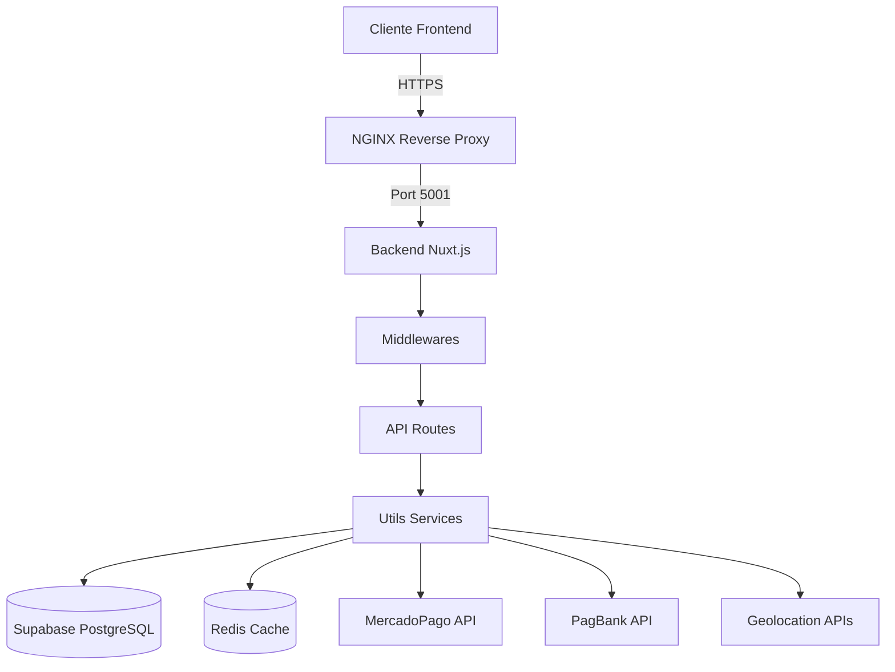
```mermaid
graph TB
    Client[Cliente Frontend]
    NGINX[NGINX Reverse Proxy]
    Backend[Backend Nuxt.js]
    Middleware[Middlewares]
    Routes[API Routes]
    Utils[Utils Services]
    Supabase[(Supabase PostgreSQL)]
    Redis[(Redis Cache)]
    MP[MercadoPago API]
    PB[PagBank API]
    GeoAPI[Geolocation APIs]
    
    Client -->|HTTPS| NGINX
    NGINX -->|Port 5001| Backend
    Backend --> Middleware
    Middleware --> Routes
    Routes --> Utils
    Utils --> Supabase
    Utils --> Redis
    Utils --> MP
    Utils --> PB
    Utils --> GeoAPI
```

### Camadas da Aplicação

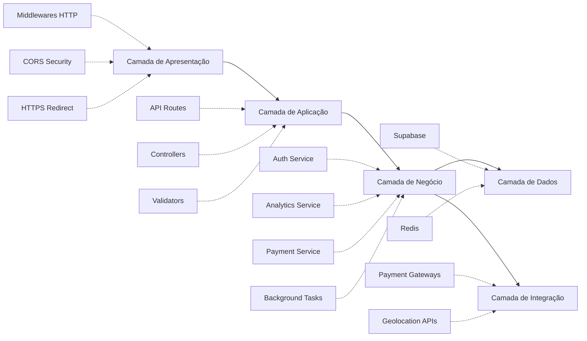
```mermaid
graph LR
    A[Camada de Apresentação] --> B[Camada de Aplicação]
    B --> C[Camada de Negócio]
    C --> D[Camada de Dados]
    C --> E[Camada de Integração]
    
    A1[Middlewares HTTP] -.-> A
    A2[CORS Security] -.-> A
    A3[HTTPS Redirect] -.-> A
    
    B1[API Routes] -.-> B
    B2[Controllers] -.-> B
    B3[Validators] -.-> B
    
    C1[Auth Service] -.-> C
    C2[Analytics Service] -.-> C
    C3[Payment Service] -.-> C
    C4[Background Tasks] -.-> C
    
    D1[Supabase] -.-> D
    D2[Redis] -.-> D
    
    E1[Payment Gateways] -.-> E
    E2[Geolocation APIs] -.-> E
```

---

## 🔐 Fluxo de Autenticação

### Login de Usuário

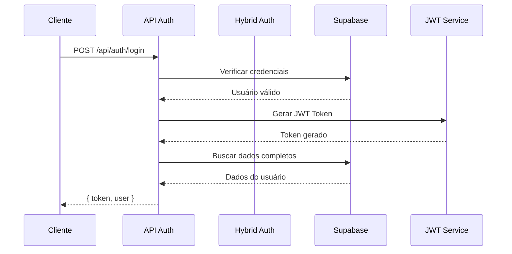
```mermaid
sequenceDiagram
    participant C as Cliente
    participant A as API Auth
    participant H as Hybrid Auth
    participant S as Supabase
    participant J as JWT Service
    
    C->>A: POST /api/auth/login
    A->>S: Verificar credenciais
    S-->>A: Usuário válido
    A->>J: Gerar JWT Token
    J-->>A: Token gerado
    A->>S: Buscar dados completos
    S-->>A: Dados do usuário
    A-->>C: { token, user }
```

### Validação de Token

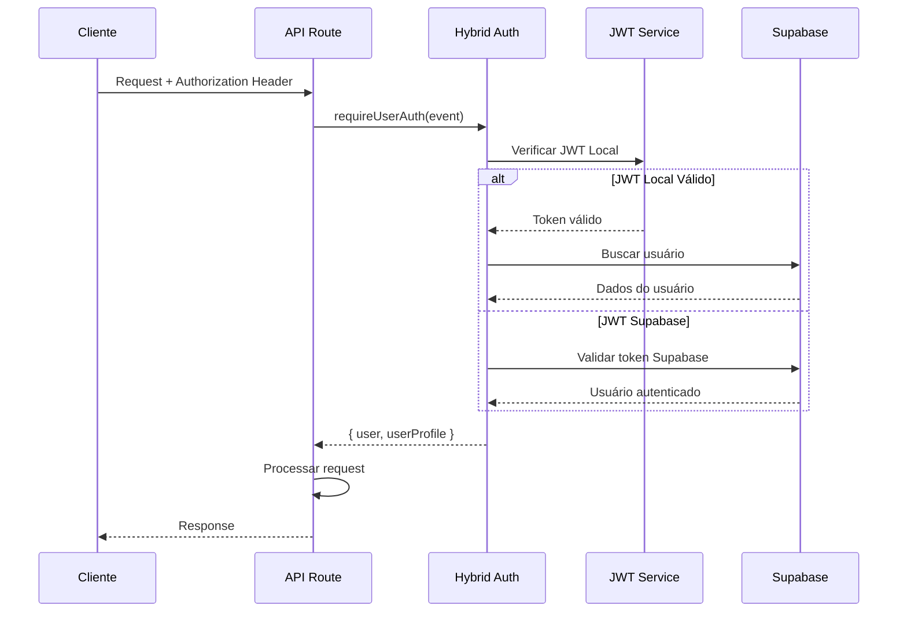
```mermaid
sequenceDiagram
    participant C as Cliente
    participant A as API Route
    participant H as Hybrid Auth
    participant J as JWT Service
    participant S as Supabase
    
    C->>A: Request + Authorization Header
    A->>H: requireUserAuth(event)
    H->>J: Verificar JWT Local
    alt JWT Local Válido
        J-->>H: Token válido
        H->>S: Buscar usuário
        S-->>H: Dados do usuário
    else JWT Supabase
        H->>S: Validar token Supabase
        S-->>H: Usuário autenticado
    end
    H-->>A: { user, userProfile }
    A->>A: Processar request
    A-->>C: Response
```

### Autenticação 2FA

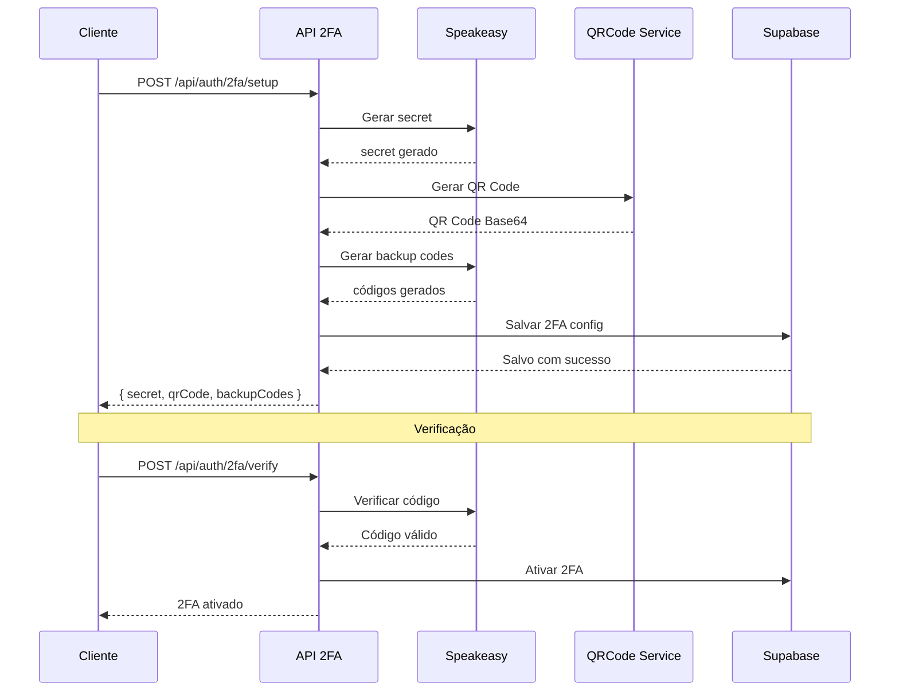
```mermaid
sequenceDiagram
    participant C as Cliente
    participant A as API 2FA
    participant SP as Speakeasy
    participant QR as QRCode Service
    participant S as Supabase
    
    C->>A: POST /api/auth/2fa/setup
    A->>SP: Gerar secret
    SP-->>A: secret gerado
    A->>QR: Gerar QR Code
    QR-->>A: QR Code Base64
    A->>SP: Gerar backup codes
    SP-->>A: códigos gerados
    A->>S: Salvar 2FA config
    S-->>A: Salvo com sucesso
    A-->>C: { secret, qrCode, backupCodes }
    
    Note over C,S: Verificação
    C->>A: POST /api/auth/2fa/verify
    A->>SP: Verificar código
    SP-->>A: Código válido
    A->>S: Ativar 2FA
    A-->>C: 2FA ativado
```

---

## 📊 Fluxo de Analytics

### Coleta de Métricas

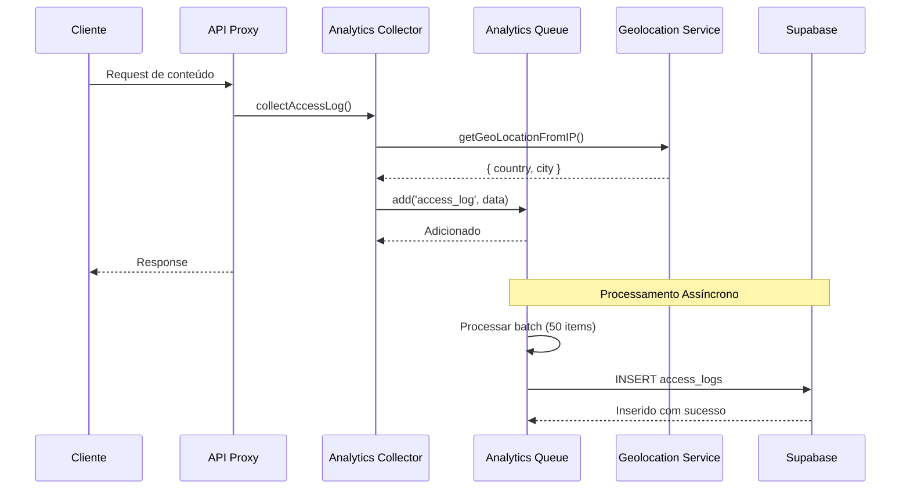
```mermaid
sequenceDiagram
    participant Client as Cliente
    participant Proxy as API Proxy
    participant Collector as Analytics Collector
    participant Queue as Analytics Queue
    participant Geo as Geolocation Service
    participant S as Supabase
    
    Client->>Proxy: Request de conteúdo
    Proxy->>Collector: collectAccessLog()
    Collector->>Geo: getGeoLocationFromIP()
    Geo-->>Collector: { country, city }
    Collector->>Queue: add('access_log', data)
    Queue-->>Collector: Adicionado
    Proxy-->>Client: Response
    
    Note over Queue,S: Processamento Assíncrono
    Queue->>Queue: Processar batch (50 items)
    Queue->>S: INSERT access_logs
    S-->>Queue: Inserido com sucesso
```

### Agregação de Analytics

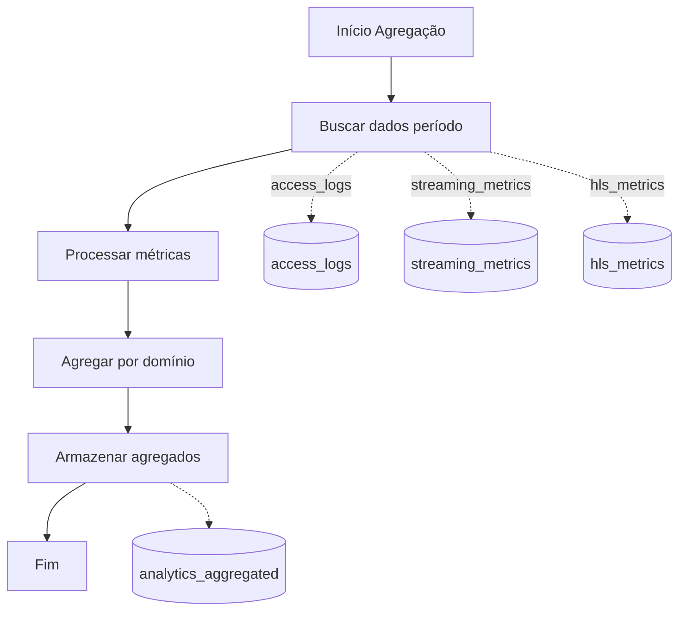
```mermaid
graph TB
    Start[Início Agregação]
    Fetch[Buscar dados período]
    Process[Processar métricas]
    Aggregate[Agregar por domínio]
    Store[Armazenar agregados]
    End[Fim]
    
    Start --> Fetch
    Fetch --> Process
    Process --> Aggregate
    Aggregate --> Store
    Store --> End
    
    Fetch -.->|access_logs| DB1[(access_logs)]
    Fetch -.->|streaming_metrics| DB2[(streaming_metrics)]
    Fetch -.->|hls_metrics| DB3[(hls_metrics)]
    Store -.-> DB4[(analytics_aggregated)]
```

### Consulta de Analytics

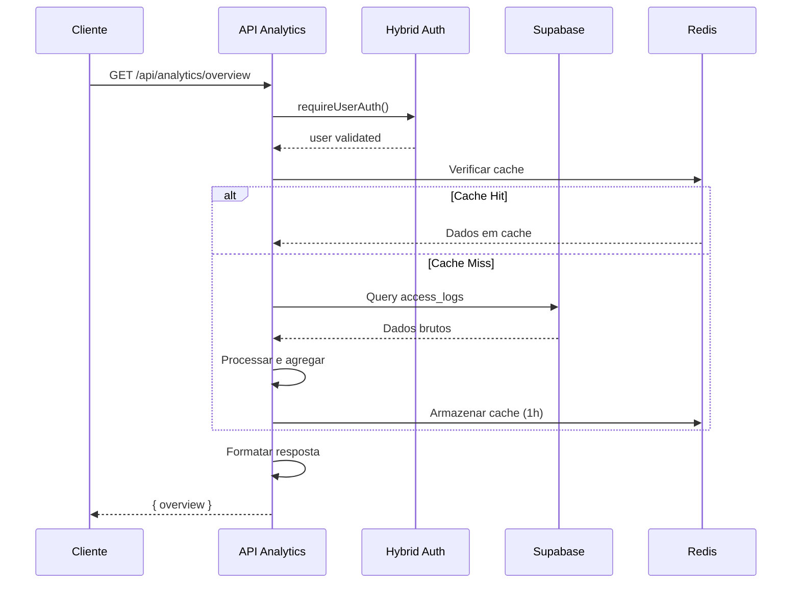
```mermaid
sequenceDiagram
    participant C as Cliente
    participant A as API Analytics
    participant Auth as Hybrid Auth
    participant S as Supabase
    participant Cache as Redis
    
    C->>A: GET /api/analytics/overview
    A->>Auth: requireUserAuth()
    Auth-->>A: user validated
    
    A->>Cache: Verificar cache
    alt Cache Hit
        Cache-->>A: Dados em cache
    else Cache Miss
        A->>S: Query access_logs
        S-->>A: Dados brutos
        A->>A: Processar e agregar
        A->>Cache: Armazenar cache (1h)
    end
    
    A->>A: Formatar resposta
    A-->>C: { overview }
```

---

## 💳 Fluxo de Pagamentos

### Criação de Pagamento

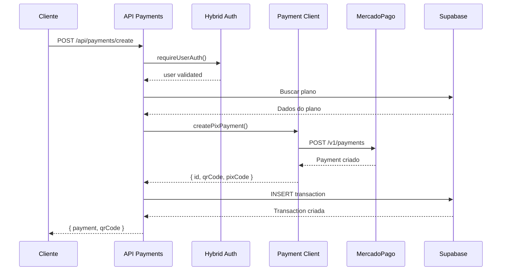
```mermaid
sequenceDiagram
    participant C as Cliente
    participant A as API Payments
    participant Auth as Hybrid Auth
    participant PC as Payment Client
    participant MP as MercadoPago
    participant S as Supabase
    
    C->>A: POST /api/payments/create
    A->>Auth: requireUserAuth()
    Auth-->>A: user validated
    
    A->>S: Buscar plano
    S-->>A: Dados do plano
    
    A->>PC: createPixPayment()
    PC->>MP: POST /v1/payments
    MP-->>PC: Payment criado
    PC-->>A: { id, qrCode, pixCode }
    
    A->>S: INSERT transaction
    S-->>A: Transaction criada
    
    A-->>C: { payment, qrCode }
```

### Processamento de Webhook

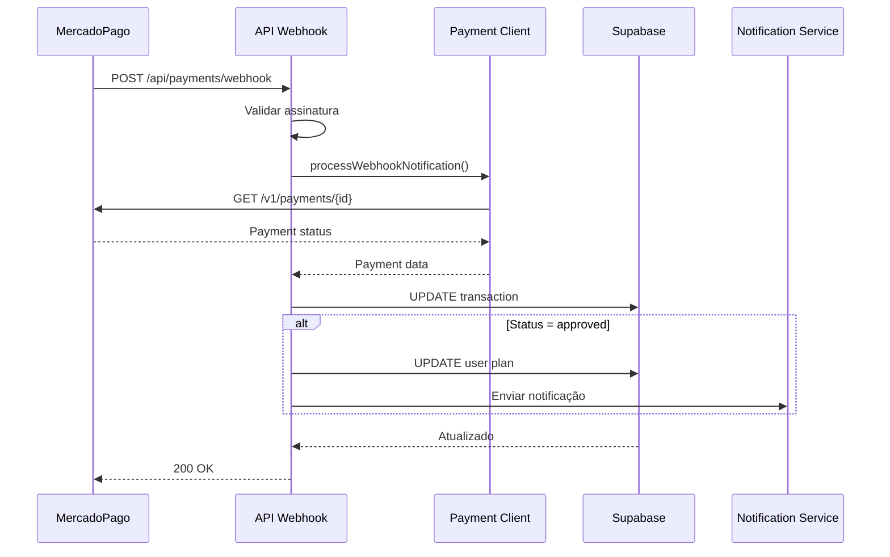
```mermaid
sequenceDiagram
    participant MP as MercadoPago
    participant W as API Webhook
    participant PC as Payment Client
    participant S as Supabase
    participant N as Notification Service
    
    MP->>W: POST /api/payments/webhook
    W->>W: Validar assinatura
    
    W->>PC: processWebhookNotification()
    PC->>MP: GET /v1/payments/{id}
    MP-->>PC: Payment status
    PC-->>W: Payment data
    
    W->>S: UPDATE transaction
    alt Status = approved
        W->>S: UPDATE user plan
        W->>N: Enviar notificação
    end
    S-->>W: Atualizado
    
    W-->>MP: 200 OK
```

### Fluxo Completo

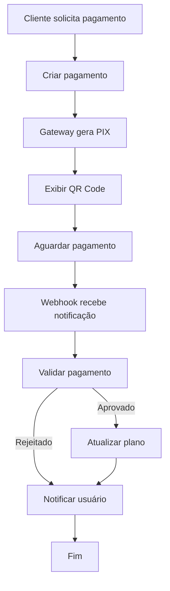
```mermaid
graph TB
    Start[Cliente solicita pagamento]
    Create[Criar pagamento]
    Gateway[Gateway gera PIX]
    Show[Exibir QR Code]
    Wait[Aguardar pagamento]
    Webhook[Webhook recebe notificação]
    Validate[Validar pagamento]
    Update[Atualizar plano]
    Notify[Notificar usuário]
    End[Fim]
    
    Start --> Create
    Create --> Gateway
    Gateway --> Show
    Show --> Wait
    Wait --> Webhook
    Webhook --> Validate
    Validate -->|Aprovado| Update
    Validate -->|Rejeitado| Notify
    Update --> Notify
    Notify --> End
```

---

## ⚙️ Sistema de Background Tasks

### Gerenciamento de Tarefas

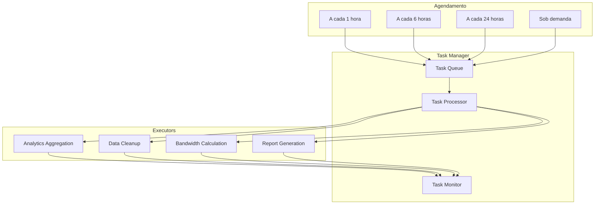
```mermaid
graph TB
    subgraph Agendamento
        Cron1[A cada 1 hora]
        Cron2[A cada 6 horas]
        Cron3[A cada 24 horas]
        Manual[Sob demanda]
    end
    
    subgraph Task Manager
        Queue[Task Queue]
        Processor[Task Processor]
        Monitor[Task Monitor]
    end
    
    subgraph Executors
        Analytics[Analytics Aggregation]
        Cleanup[Data Cleanup]
        Bandwidth[Bandwidth Calculation]
        Reports[Report Generation]
    end
    
    Cron1 --> Queue
    Cron2 --> Queue
    Cron3 --> Queue
    Manual --> Queue
    
    Queue --> Processor
    Processor --> Analytics
    Processor --> Cleanup
    Processor --> Bandwidth
    Processor --> Reports
    
    Analytics --> Monitor
    Cleanup --> Monitor
    Bandwidth --> Monitor
    Reports --> Monitor
```

### Ciclo de Vida de uma Tarefa

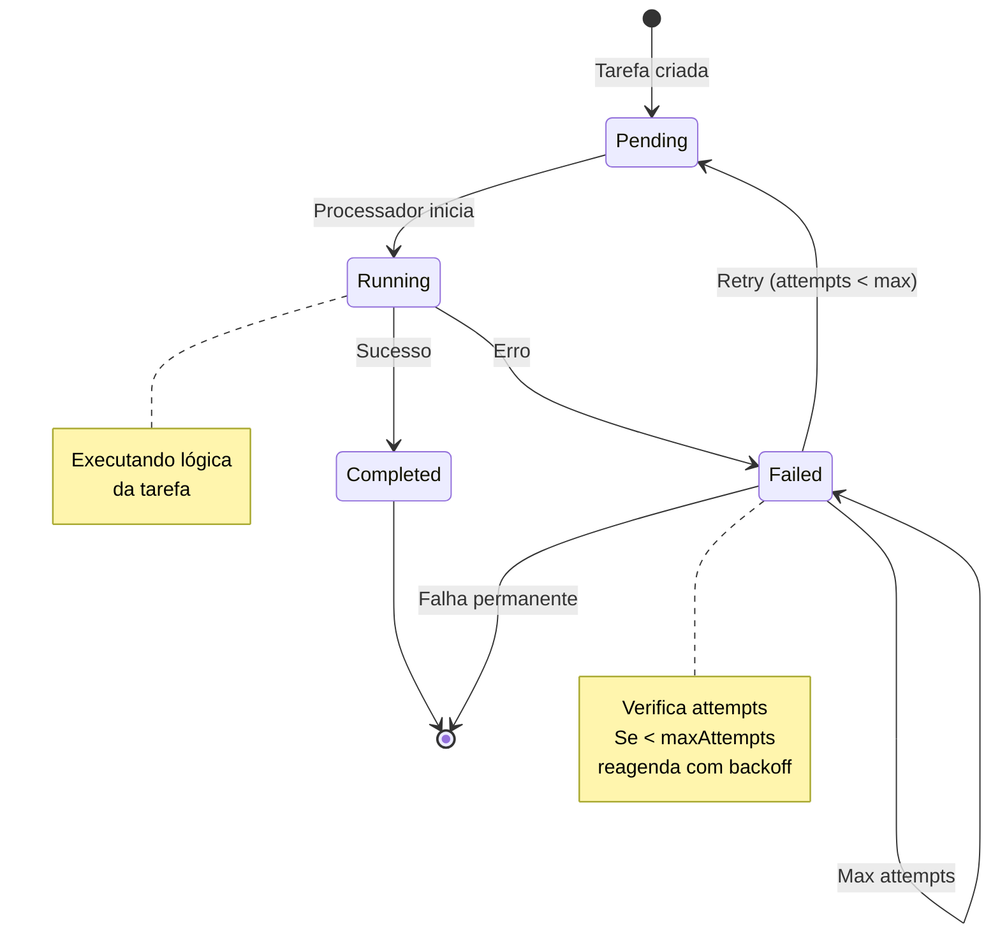
```mermaid
stateDiagram-v2
    [*] --> Pending: Tarefa criada
    Pending --> Running: Processador inicia
    Running --> Completed: Sucesso
    Running --> Failed: Erro
    Failed --> Pending: Retry (attempts < max)
    Failed --> Failed: Max attempts
    Completed --> [*]
    Failed --> [*]: Falha permanente
    
    note right of Running
        Executando lógica
        da tarefa
    end note
    
    note right of Failed
        Verifica attempts
        Se < maxAttempts
        reagenda com backoff
    end note
```

### Processamento em Batch

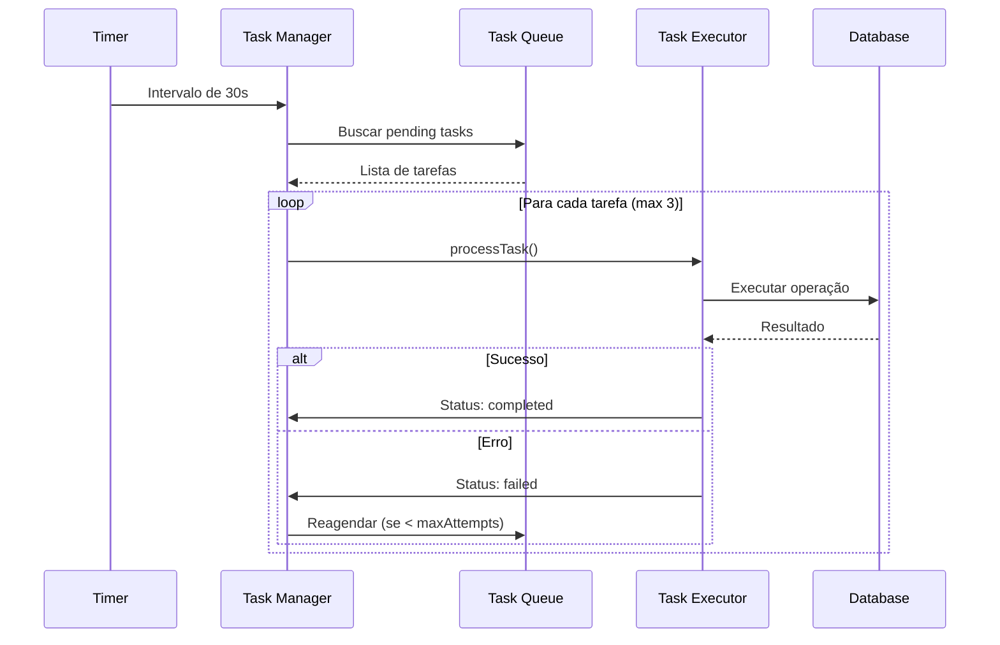
```mermaid
sequenceDiagram
    participant Timer as Timer
    participant TM as Task Manager
    participant Queue as Task Queue
    participant Executor as Task Executor
    participant DB as Database
    
    Timer->>TM: Intervalo de 30s
    TM->>Queue: Buscar pending tasks
    Queue-->>TM: Lista de tarefas
    
    loop Para cada tarefa (max 3)
        TM->>Executor: processTask()
        Executor->>DB: Executar operação
        DB-->>Executor: Resultado
        alt Sucesso
            Executor->>TM: Status: completed
        else Erro
            Executor->>TM: Status: failed
            TM->>Queue: Reagendar (se < maxAttempts)
        end
    end
```

---

## 💾 Arquitetura de Dados

### Modelo de Dados Principal

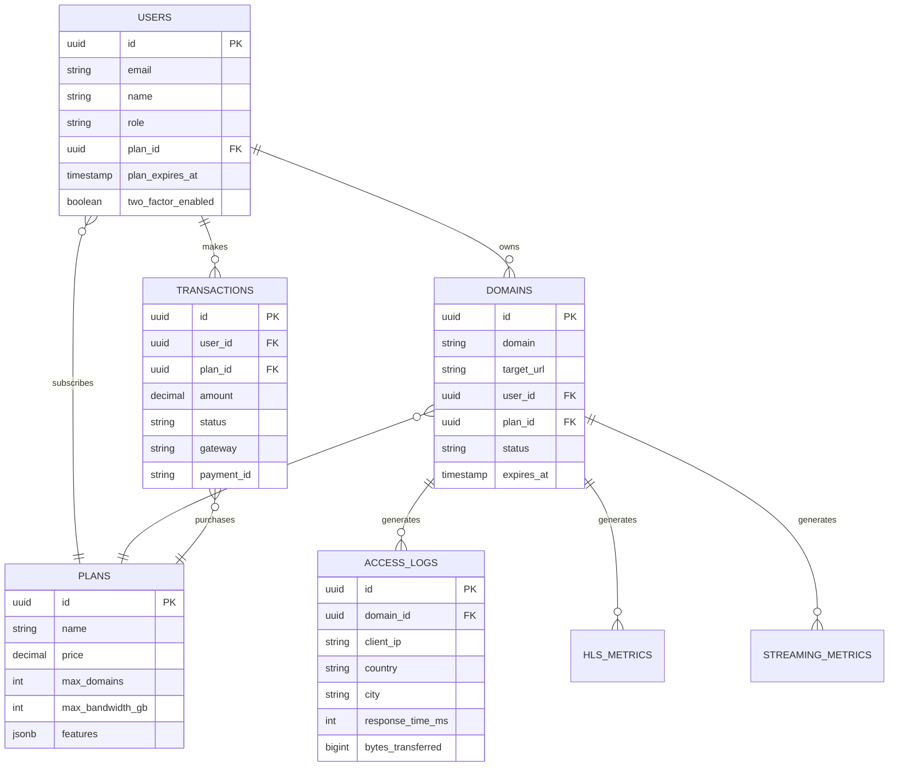
```mermaid
erDiagram
    USERS ||--o{ DOMAINS : owns
    USERS ||--o{ TRANSACTIONS : makes
    USERS }o--|| PLANS : subscribes
    DOMAINS }o--|| PLANS : uses
    DOMAINS ||--o{ ACCESS_LOGS : generates
    DOMAINS ||--o{ HLS_METRICS : generates
    DOMAINS ||--o{ STREAMING_METRICS : generates
    TRANSACTIONS }o--|| PLANS : purchases
    
    USERS {
        uuid id PK
        string email
        string name
        string role
        uuid plan_id FK
        timestamp plan_expires_at
        boolean two_factor_enabled
    }
    
    DOMAINS {
        uuid id PK
        string domain
        string target_url
        uuid user_id FK
        uuid plan_id FK
        string status
        timestamp expires_at
    }
    
    PLANS {
        uuid id PK
        string name
        decimal price
        int max_domains
        int max_bandwidth_gb
        jsonb features
    }
    
    TRANSACTIONS {
        uuid id PK
        uuid user_id FK
        uuid plan_id FK
        decimal amount
        string status
        string gateway
        string payment_id
    }
    
    ACCESS_LOGS {
        uuid id PK
        uuid domain_id FK
        string client_ip
        string country
        string city
        int response_time_ms
        bigint bytes_transferred
    }
```

### Cache Strategy

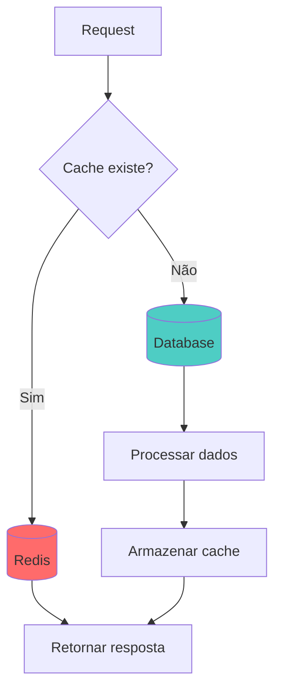
```mermaid
graph TB
    Request[Request]
    CheckCache{Cache existe?}
    Redis[(Redis)]
    DB[(Database)]
    Process[Processar dados]
    SetCache[Armazenar cache]
    Return[Retornar resposta]
    
    Request --> CheckCache
    CheckCache -->|Sim| Redis
    CheckCache -->|Não| DB
    Redis --> Return
    DB --> Process
    Process --> SetCache
    SetCache --> Return
    
    style Redis fill:#ff6b6b
    style DB fill:#4ecdc4
```

### Fluxo de Dados - Analytics

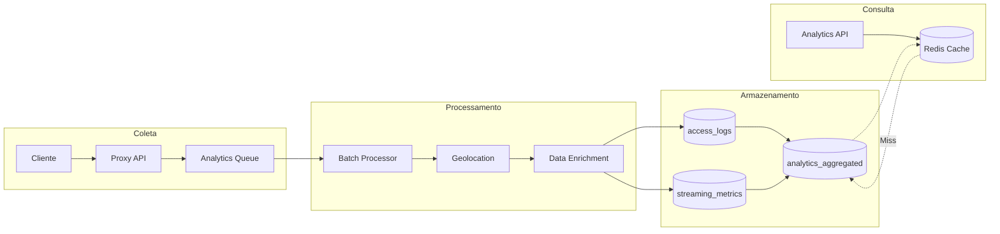
```mermaid
graph LR
    subgraph Coleta
        Client[Cliente]
        Proxy[Proxy API]
        Queue[Analytics Queue]
    end
    
    subgraph Processamento
        Batch[Batch Processor]
        Geo[Geolocation]
        Enrich[Data Enrichment]
    end
    
    subgraph Armazenamento
        Raw[(access_logs)]
        Metrics[(streaming_metrics)]
        Aggregated[(analytics_aggregated)]
    end
    
    subgraph Consulta
        API[Analytics API]
        Cache[(Redis Cache)]
    end
    
    Client --> Proxy
    Proxy --> Queue
    Queue --> Batch
    Batch --> Geo
    Geo --> Enrich
    Enrich --> Raw
    Enrich --> Metrics
    
    Raw --> Aggregated
    Metrics --> Aggregated
    
    API --> Cache
    Cache -.->|Miss| Aggregated
    Aggregated -.-> Cache
```

---

## 🔄 Ciclo de Requisição Completo

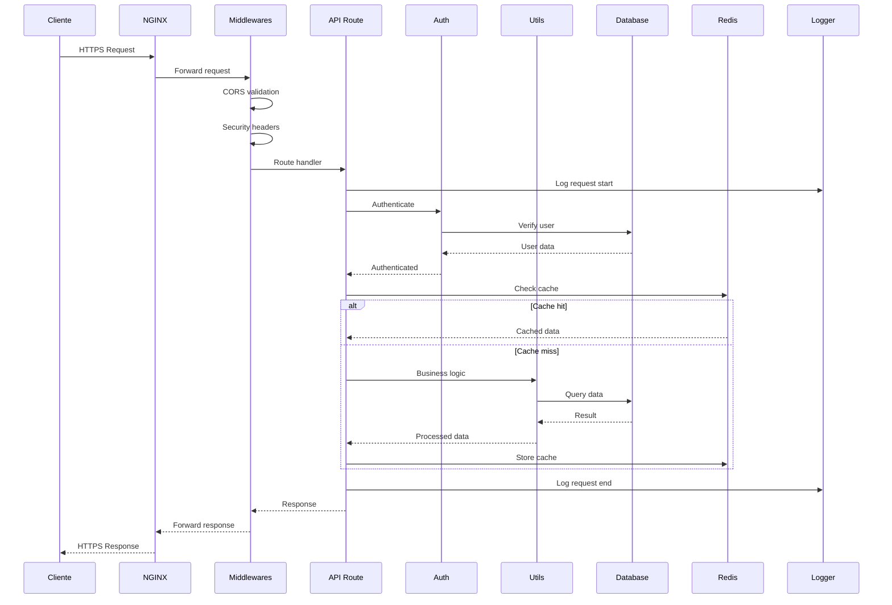
```mermaid
sequenceDiagram
    participant C as Cliente
    participant N as NGINX
    participant M as Middlewares
    participant R as API Route
    participant A as Auth
    participant U as Utils
    participant DB as Database
    participant Cache as Redis
    participant L as Logger
    
    C->>N: HTTPS Request
    N->>M: Forward request
    
    M->>M: CORS validation
    M->>M: Security headers
    
    M->>R: Route handler
    R->>L: Log request start
    
    R->>A: Authenticate
    A->>DB: Verify user
    DB-->>A: User data
    A-->>R: Authenticated
    
    R->>Cache: Check cache
    alt Cache hit
        Cache-->>R: Cached data
    else Cache miss
        R->>U: Business logic
        U->>DB: Query data
        DB-->>U: Result
        U-->>R: Processed data
        R->>Cache: Store cache
    end
    
    R->>L: Log request end
    R-->>M: Response
    M-->>N: Forward response
    N-->>C: HTTPS Response
```

---

## 🚨 Sistema de Alertas

### Fluxo de Alerta

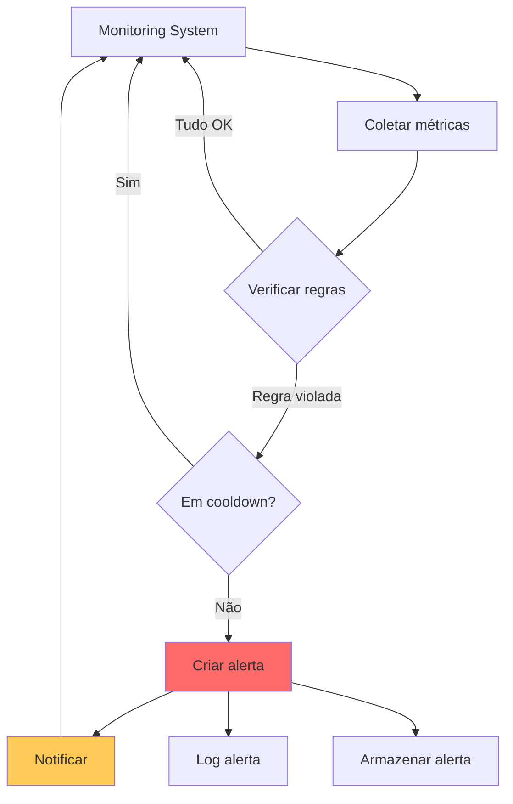
```mermaid
graph TB
    Monitor[Monitoring System]
    Collect[Coletar métricas]
    Check{Verificar regras}
    Alert[Criar alerta]
    Cooldown{Em cooldown?}
    Notify[Notificar]
    Log[Log alerta]
    Store[Armazenar alerta]
    
    Monitor --> Collect
    Collect --> Check
    Check -->|Regra violada| Cooldown
    Check -->|Tudo OK| Monitor
    Cooldown -->|Não| Alert
    Cooldown -->|Sim| Monitor
    Alert --> Notify
    Alert --> Log
    Alert --> Store
    Notify --> Monitor
    
    style Alert fill:#ff6b6b
    style Notify fill:#feca57
```

### Hierarquia de Severidade

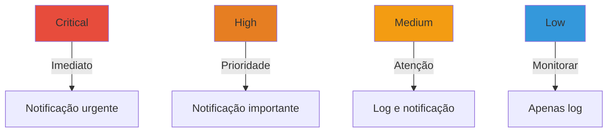
```mermaid
graph TD
    Critical[Critical]
    High[High]
    Medium[Medium]
    Low[Low]
    
    Critical -->|Imediato| Action1[Notificação urgente]
    High -->|Prioridade| Action2[Notificação importante]
    Medium -->|Atenção| Action3[Log e notificação]
    Low -->|Monitorar| Action4[Apenas log]
    
    style Critical fill:#e74c3c
    style High fill:#e67e22
    style Medium fill:#f39c12
    style Low fill:#3498db
```

---

## 📈 Performance e Escalabilidade

### Load Balancing (Futuro)

```mermaid
graph TB
    Client[Clientes]
    LB[Load Balancer]
    B1[Backend Instance 1]
    B2[Backend Instance 2]
    B3[Backend Instance 3]
    Redis[(Redis Shared)]
    DB[(Database Cluster)]
    
    Client --> LB
    LB --> B1
    LB --> B2
    LB --> B3
    
    B1 --> Redis
    B2 --> Redis
    B3 --> Redis
    
    B1 --> DB
    B2 --> DB
    B3 --> DB
```

### Caching Strategy

```mermaid
graph LR
    subgraph Application Layer
        API[API Layer]
    end
    
    subgraph Cache Layers
        L1[L1: In-Memory]
        L2[L2: Redis]
        L3[L3: Database]
    end
    
    API -->|Check| L1
    L1 -->|Miss| L2
    L2 -->|Miss| L3
    L3 -->|Store| L2
    L2 -->|Store| L1
    
    style L1 fill:#2ecc71
    style L2 fill:#3498db
    style L3 fill:#9b59b6
```

---

**Versão:** 1.2.2  
**Última Atualização:** 25/10/2025
