# 🏗️ Diagramas de Arquitetura - CDN Proxy Backend

## 📋 Índice

1. [Arquitetura Geral](#arquitetura-geral)
2. [Fluxo de Autenticação](#fluxo-de-autenticação)
3. [Fluxo de Analytics](#fluxo-de-analytics)
4. [Fluxo de Pagamentos](#fluxo-de-pagamentos)
5. [Sistema de Background Tasks](#sistema-de-background-tasks)
6. [Arquitetura de Dados](#arquitetura-de-dados)

---

## 🏛️ Arquitetura Geral

### Visão de Alto Nível


### Camadas da Aplicação

```mermaid
graph LR
    A[Camada de Apresentação] --> B[Camada de Aplicação]
    B --> C[Camada de Negócio]
    C --> D[Camada de Dados]
    C --> E[Camada de Integração]
    
    A1[Middlewares HTTP] -.-> A
    A2[CORS Security] -.-> A
    A3[HTTPS Redirect] -.-> A
    
    B1[API Routes] -.-> B
    B2[Controllers] -.-> B
    B3[Validators] -.-> B
    
    C1[Auth Service] -.-> C
    C2[Analytics Service] -.-> C
    C3[Payment Service] -.-> C
    C4[Background Tasks] -.-> C
    
    D1[Supabase] -.-> D
    D2[Redis] -.-> D
    
    E1[Payment Gateways] -.-> E
    E2[Geolocation APIs] -.-> E
```



---

## 🔐 Fluxo de Autenticação

### Login de Usuário


### Validação de Token

```mermaid
sequenceDiagram
    participant C as Cliente
    participant A as API Route
    participant H as Hybrid Auth
    participant J as JWT Service
    participant S as Supabase
    
    C->>A: Request + Authorization Header
    A->>H: requireUserAuth(event)
    H->>J: Verificar JWT Local
    alt JWT Local Válido
        J-->>H: Token válido
        H->>S: Buscar usuário
        S-->>H: Dados do usuário
    else JWT Supabase
        H->>S: Validar token Supabase
        S-->>H: Usuário autenticado
    end
    H-->>A: { user, userProfile }
    A->>A: Processar request
    A-->>C: Response
```



### Autenticação 2FA


---

## 📊 Fluxo de Analytics

### Coleta de Métricas


### Agregação de Analytics

```mermaid
graph TB
    Start[Início Agregação]
    Fetch[Buscar dados período]
    Process[Processar métricas]
    Aggregate[Agregar por domínio]
    Store[Armazenar agregados]
    End[Fim]
    
    Start --> Fetch
    Fetch --> Process
    Process --> Aggregate
    Aggregate --> Store
    Store --> End
    
    Fetch -.->|access_logs| DB1[(access_logs)]
    Fetch -.->|streaming_metrics| DB2[(streaming_metrics)]
    Fetch -.->|hls_metrics| DB3[(hls_metrics)]
    Store -.-> DB4[(analytics_aggregated)]
```



### Consulta de Analytics


---

## 💳 Fluxo de Pagamentos

### Criação de Pagamento


### Processamento de Webhook


### Fluxo Completo

```mermaid
graph TB
    Start[Cliente solicita pagamento]
    Create[Criar pagamento]
    Gateway[Gateway gera PIX]
    Show[Exibir QR Code]
    Wait[Aguardar pagamento]
    Webhook[Webhook recebe notificação]
    Validate[Validar pagamento]
    Update[Atualizar plano]
    Notify[Notificar usuário]
    End[Fim]
    
    Start --> Create
    Create --> Gateway
    Gateway --> Show
    Show --> Wait
    Wait --> Webhook
    Webhook --> Validate
    Validate -->|Aprovado| Update
    Validate -->|Rejeitado| Notify
    Update --> Notify
    Notify --> End
```



---

## ⚙️ Sistema de Background Tasks

### Gerenciamento de Tarefas


### Ciclo de Vida de uma Tarefa

```mermaid
stateDiagram-v2
    [*] --> Pending: Tarefa criada
    Pending --> Running: Processador inicia
    Running --> Completed: Sucesso
    Running --> Failed: Erro
    Failed --> Pending: Retry (attempts < max)
    Failed --> Failed: Max attempts
    Completed --> [*]
    Failed --> [*]: Falha permanente
    
    note right of Running
        Executando lógica
        da tarefa
    end note
    
    note right of Failed
        Verifica attempts
        Se < maxAttempts
        reagenda com backoff
    end note
```



### Processamento em Batch

```mermaid
sequenceDiagram
    participant Timer as Timer
    participant TM as Task Manager
    participant Queue as Task Queue
    participant Executor as Task Executor
    participant DB as Database
    
    Timer->>TM: Intervalo de 30s
    TM->>Queue: Buscar pending tasks
    Queue-->>TM: Lista de tarefas
    
    loop Para cada tarefa (max 3)
        TM->>Executor: processTask()
        Executor->>DB: Executar operação
        DB-->>Executor: Resultado
        alt Sucesso
            Executor->>TM: Status: completed
        else Erro
            Executor->>TM: Status: failed
            TM->>Queue: Reagendar (se < maxAttempts)
        end
    end
```



---

## 💾 Arquitetura de Dados

### Modelo de Dados Principal


### Cache Strategy


### Fluxo de Dados - Analytics


---

## 🔄 Ciclo de Requisição Completo


---

## 🚨 Sistema de Alertas

### Fluxo de Alerta

```mermaid
graph TB
    Monitor[Monitoring System]
    Collect[Coletar métricas]
    Check{Verificar regras}
    Alert[Criar alerta]
    Cooldown{Em cooldown?}
    Notify[Notificar]
    Log[Log alerta]
    Store[Armazenar alerta]
    
    Monitor --> Collect
    Collect --> Check
    Check -->|Regra violada| Cooldown
    Check -->|Tudo OK| Monitor
    Cooldown -->|Não| Alert
    Cooldown -->|Sim| Monitor
    Alert --> Notify
    Alert --> Log
    Alert --> Store
    Notify --> Monitor
    
    style Alert fill:#ff6b6b
    style Notify fill:#feca57
```



### Hierarquia de Severidade

```mermaid
graph TD
    Critical[Critical]
    High[High]
    Medium[Medium]
    Low[Low]
    
    Critical -->|Imediato| Action1[Notificação urgente]
    High -->|Prioridade| Action2[Notificação importante]
    Medium -->|Atenção| Action3[Log e notificação]
    Low -->|Monitorar| Action4[Apenas log]
    
    style Critical fill:#e74c3c
    style High fill:#e67e22
    style Medium fill:#f39c12
    style Low fill:#3498db
```



---

## 📈 Performance e Escalabilidade

### Load Balancing (Futuro)

```mermaid
graph TB
    Client[Clientes]
    LB[Load Balancer]
    B1[Backend Instance 1]
    B2[Backend Instance 2]
    B3[Backend Instance 3]
    Redis[(Redis Shared)]
    DB[(Database Cluster)]
    
    Client --> LB
    LB --> B1
    LB --> B2
    LB --> B3
    
    B1 --> Redis
    B2 --> Redis
    B3 --> Redis
    
    B1 --> DB
    B2 --> DB
    B3 --> DB
```

### Caching Strategy

```mermaid
graph LR
    subgraph Application Layer
        API[API Layer]
    end
    
    subgraph Cache Layers
        L1[L1: In-Memory]
        L2[L2: Redis]
        L3[L3: Database]
    end
    
    API -->|Check| L1
    L1 -->|Miss| L2
    L2 -->|Miss| L3
    L3 -->|Store| L2
    L2 -->|Store| L1
    
    style L1 fill:#2ecc71
    style L2 fill:#3498db
    style L3 fill:#9b59b6
```

---

**Versão:** 1.2.2  
**Última Atualização:** 25/10/2025
