# 🔌 Guia de Integração PIX - Frontend

## 📋 Sumário

1. [Visão Geral](#visão-geral)
2. [Configuração Inicial](#configuração-inicial)
3. [Autenticação](#autenticação)
4. [APIs Disponíveis](#apis-disponíveis)
5. [Implementação Frontend](#implementação-frontend)
6. [Tratamento de Erros](#tratamento-de-erros)
7. [Exemplos Práticos](#exemplos-práticos)
8. [Fluxo Completo](#fluxo-completo)
9. [Troubleshooting](#troubleshooting)

---

## 🎯 Visão Geral

Este guia detalha como integrar o sistema de pagamentos PIX do **Backend (Server2)** com o **Frontend (Server1)** do CDNProxy.

### Arquitetura

```
┌─────────────────┐          HTTPS          ┌─────────────────┐
│                 │  ────────────────────▶   │                 │
│  Frontend       │                          │  Backend API    │
│  (Server1)      │  ◀────────────────────   │  (Server2)      │
│                 │      JSON Response       │                 │
└─────────────────┘                          └─────────────────┘
app.cdnproxy.top                             api.cdnproxy.top
```

### URLs Base

| Ambiente | Frontend | Backend API |
|----------|----------|-------------|
| **Produção** | `https://app.cdnproxy.top` | `https://api.cdnproxy.top` |
| **Local** | `http://localhost:3000` | `http://localhost:5001` |

---

## ⚙️ Configuração Inicial

### 1. Variáveis de Ambiente

Crie um arquivo `.env` no seu frontend:

```bash
# .env
VITE_API_URL=https://api.cdnproxy.top
VITE_FRONTEND_URL=https://app.cdnproxy.top

# Ou para desenvolvimento local
# VITE_API_URL=http://localhost:5001
# VITE_FRONTEND_URL=http://localhost:3000
```

### 2. Configuração HTTP Client

#### Usando Axios (Recomendado)

```javascript
// services/api.js
import axios from 'axios'

const api = axios.create({
  baseURL: import.meta.env.VITE_API_URL,
  timeout: 30000,
  headers: {
    'Content-Type': 'application/json',
  }
})

// Interceptor para adicionar token automaticamente
api.interceptors.request.use(
  (config) => {
    const token = localStorage.getItem('auth_token')
    if (token) {
      config.headers.Authorization = `Bearer ${token}`
      config.headers['x-supabase-token'] = token
    }
    return config
  },
  (error) => {
    return Promise.reject(error)
  }
)

// Interceptor para tratamento de erros
api.interceptors.response.use(
  (response) => response,
  (error) => {
    if (error.response?.status === 401) {
      // Token expirado - redirecionar para login
      localStorage.removeItem('auth_token')
      window.location.href = '/login'
    }
    return Promise.reject(error)
  }
)

export default api
```

#### Usando Fetch (Nativo)

```javascript
// services/api.js
const API_URL = import.meta.env.VITE_API_URL

class ApiClient {
  async request(endpoint, options = {}) {
    const token = localStorage.getItem('auth_token')
    
    const config = {
      ...options,
      headers: {
        'Content-Type': 'application/json',
        ...(token && {
          'Authorization': `Bearer ${token}`,
          'x-supabase-token': token
        }),
        ...options.headers,
      },
    }

    const response = await fetch(`${API_URL}${endpoint}`, config)
    
    if (!response.ok) {
      if (response.status === 401) {
        localStorage.removeItem('auth_token')
        window.location.href = '/login'
      }
      const error = await response.json()
      throw new Error(error.message || 'Erro na requisição')
    }

    return response.json()
  }

  get(endpoint) {
    return this.request(endpoint, { method: 'GET' })
  }

  post(endpoint, data) {
    return this.request(endpoint, {
      method: 'POST',
      body: JSON.stringify(data),
    })
  }

  put(endpoint, data) {
    return this.request(endpoint, {
      method: 'PUT',
      body: JSON.stringify(data),
    })
  }
}

export default new ApiClient()
```

---

## 🔐 Autenticação

### 1. Login do Usuário

```javascript
// services/auth.js
import api from './api'

export const authService = {
  /**
   * Faz login e retorna o token
   * @param {string} email 
   * @param {string} password 
   * @returns {Promise<{token: string, user: object}>}
   */
  async login(email, password) {
    const response = await api.post('/api/auth/login', {
      email,
      password
    })
    
    if (response.data?.token) {
      // Armazenar token
      localStorage.setItem('auth_token', response.data.token)
      
      // Armazenar dados do usuário
      if (response.data.user) {
        localStorage.setItem('user', JSON.stringify(response.data.user))
      }
    }
    
    return response.data
  },

  /**
   * Faz logout
   */
  logout() {
    localStorage.removeItem('auth_token')
    localStorage.removeItem('user')
    window.location.href = '/login'
  },

  /**
   * Retorna o token armazenado
   */
  getToken() {
    return localStorage.getItem('auth_token')
  },

  /**
   * Retorna dados do usuário
   */
  getUser() {
    const user = localStorage.getItem('user')
    return user ? JSON.parse(user) : null
  },

  /**
   * Verifica se está autenticado
   */
  isAuthenticated() {
    return !!this.getToken()
  }
}
```

### 2. Exemplo de Uso do Login

```vue
<!-- pages/Login.vue -->
<template>
  <div class="login-page">
    <form @submit.prevent="handleLogin">
      <input 
        v-model="email" 
        type="email" 
        placeholder="Email"
        required
      />
      <input 
        v-model="password" 
        type="password" 
        placeholder="Senha"
        required
      />
      <button type="submit" :disabled="loading">
        {{ loading ? 'Entrando...' : 'Entrar' }}
      </button>
      <p v-if="error" class="error">{{ error }}</p>
    </form>
  </div>
</template>

<script setup>
import { ref } from 'vue'
import { useRouter } from 'vue-router'
import { authService } from '@/services/auth'

const router = useRouter()
const email = ref('')
const password = ref('')
const loading = ref(false)
const error = ref('')

const handleLogin = async () => {
  loading.value = true
  error.value = ''
  
  try {
    await authService.login(email.value, password.value)
    router.push('/dashboard')
  } catch (err) {
    error.value = err.message || 'Erro ao fazer login'
  } finally {
    loading.value = false
  }
}
</script>
```

---

## 🔌 APIs Disponíveis

### 1. API de Pagamento PIX

#### Endpoint Principal

**POST** `/api/admin/payments/pix`

#### Headers Obrigatórios

```javascript
{
  "Content-Type": "application/json",
  "Authorization": "Bearer {seu_token}",
  "x-supabase-token": "{seu_token}"
}
```

#### Body da Requisição

```typescript
interface PixPaymentRequest {
  domains: string[]      // Array de IDs dos domínios
  plan_id: string        // ID do plano
  amount: number         // Valor em BRL (ex: 35.99)
}
```

#### Resposta de Sucesso

```typescript
interface PixPaymentResponse {
  success: boolean
  data: {
    transaction_id: string       // UUID da transação
    pix_key: string              // Chave PIX (ex: admin@cdnproxy.top)
    pix_key_type: string         // Tipo: EMAIL, CPF, CNPJ, PHONE, RANDOM
    amount: number               // Valor do pagamento
    description: string          // Descrição do pagamento
    pix_code: string             // Código EMV do PIX (Pix Copia e Cola)
    qr_code: string              // Código EMV (mesmo que pix_code)
    qr_code_image: string        // QR Code em Data URL (base64)
    qr_code_base64: string       // QR Code apenas base64
    domains: Array<{             // Domínios incluídos
      id: string
      domain: string
    }>
    expires_at: string           // Data de expiração (30 minutos)
  }
}
```

### 2. API de Confirmação de Pagamento

**POST** `/api/admin/payments/confirm-pix`

```javascript
{
  "transaction_id": "uuid-da-transacao"
}
```

### 3. API de Consulta de Status

**GET** `/api/payments/status/{transaction_id}`

---

## 💻 Implementação Frontend

### 1. Service de Pagamentos PIX

```javascript
// services/pixPayment.js
import api from './api'

export const pixPaymentService = {
  /**
   * Cria um novo pagamento PIX
   * @param {string[]} domainIds - Array de IDs dos domínios
   * @param {string} planId - ID do plano
   * @param {number} amount - Valor do pagamento
   * @returns {Promise<PixPaymentResponse>}
   */
  async createPayment(domainIds, planId, amount) {
    try {
      const response = await api.post('/api/admin/payments/pix', {
        domains: domainIds,
        plan_id: planId,
        amount: amount
      })

      if (response.data?.success) {
        return response.data.data
      }

      throw new Error(response.data?.message || 'Erro ao criar pagamento')
    } catch (error) {
      console.error('Erro ao criar pagamento PIX:', error)
      throw error
    }
  },

  /**
   * Confirma que o pagamento foi realizado
   * @param {string} transactionId - ID da transação
   */
  async confirmPayment(transactionId) {
    try {
      const response = await api.post('/api/admin/payments/confirm-pix', {
        transaction_id: transactionId
      })

      return response.data
    } catch (error) {
      console.error('Erro ao confirmar pagamento:', error)
      throw error
    }
  },

  /**
   * Consulta o status de um pagamento
   * @param {string} transactionId - ID da transação
   */
  async getPaymentStatus(transactionId) {
    try {
      const response = await api.get(`/api/payments/status/${transactionId}`)
      return response.data
    } catch (error) {
      console.error('Erro ao consultar status:', error)
      throw error
    }
  }
}
```

### 2. Componente de Pagamento PIX (Vue 3)

```vue
<!-- components/PixPayment.vue -->
<template>
  <div class="pix-payment">
    <!-- Botão para iniciar pagamento -->
    <button 
      v-if="!pixData"
      @click="createPixPayment"
      :disabled="loading"
      class="btn-primary"
    >
      {{ loading ? 'Gerando PIX...' : 'Pagar com PIX' }}
    </button>

    <!-- Modal com QR Code -->
    <div v-if="pixData" class="pix-modal">
      <div class="pix-content">
        <h2>Pagamento PIX</h2>
        
        <!-- QR Code -->
        <div class="qr-code-section">
          
          <p class="qr-instructions">
            Escaneie o QR Code com o app do seu banco
          </p>
        </div>

        <!-- Código Pix Copia e Cola -->
        <div class="pix-code-section">
          <p class="section-title">Ou use o Pix Copia e Cola:</p>
          <div class="code-container">
            <input 
              type="text" 
              :value="pixData.pix_code" 
              readonly
              ref="pixCodeInput"
              class="pix-code-input"
            />
            <button @click="copyPixCode" class="btn-copy">
              {{ copied ? '✓ Copiado!' : 'Copiar' }}
            </button>
          </div>
        </div>

        <!-- Informações do Pagamento -->
        <div class="payment-info">
          <div class="info-row">
            <span class="label">Valor:</span>
            <span class="value">R$ {{ formatMoney(pixData.amount) }}</span>
          </div>
          <div class="info-row">
            <span class="label">Domínios:</span>
            <span class="value">{{ pixData.domains.length }}</span>
          </div>
          <div class="info-row">
            <span class="label">Chave PIX:</span>
            <span class="value">{{ pixData.pix_key }}</span>
          </div>
          <div class="info-row">
            <span class="label">Expira em:</span>
            <span class="value">{{ formatExpiration(pixData.expires_at) }}</span>
          </div>
        </div>

        <!-- Ações -->
        <div class="actions">
          <button 
            @click="confirmPayment"
            :disabled="confirming"
            class="btn-confirm"
          >
            {{ confirming ? 'Confirmando...' : 'Já Paguei' }}
          </button>
          <button @click="closeModal" class="btn-cancel">
            Cancelar
          </button>
        </div>

        <!-- Erro -->
        <p v-if="error" class="error-message">{{ error }}</p>
      </div>
    </div>
  </div>
</template>

<script setup>
import { ref, computed } from 'vue'
import { pixPaymentService } from '@/services/pixPayment'

const props = defineProps({
  domainIds: {
    type: Array,
    required: true
  },
  planId: {
    type: String,
    required: true
  },
  amount: {
    type: Number,
    required: true
  }
})

const emit = defineEmits(['paymentConfirmed', 'paymentCancelled'])

const loading = ref(false)
const confirming = ref(false)
const pixData = ref(null)
const error = ref('')
const copied = ref(false)
const pixCodeInput = ref(null)

// Criar pagamento PIX
const createPixPayment = async () => {
  loading.value = true
  error.value = ''
  
  try {
    pixData.value = await pixPaymentService.createPayment(
      props.domainIds,
      props.planId,
      props.amount
    )
  } catch (err) {
    error.value = err.message || 'Erro ao gerar PIX'
    console.error('Erro ao criar PIX:', err)
  } finally {
    loading.value = false
  }
}

// Copiar código PIX
const copyPixCode = async () => {
  try {
    await navigator.clipboard.writeText(pixData.value.pix_code)
    copied.value = true
    setTimeout(() => {
      copied.value = false
    }, 2000)
  } catch (err) {
    // Fallback para navegadores antigos
    pixCodeInput.value.select()
    document.execCommand('copy')
    copied.value = true
    setTimeout(() => {
      copied.value = false
    }, 2000)
  }
}

// Confirmar pagamento
const confirmPayment = async () => {
  confirming.value = true
  error.value = ''
  
  try {
    await pixPaymentService.confirmPayment(pixData.value.transaction_id)
    emit('paymentConfirmed', pixData.value.transaction_id)
    closeModal()
  } catch (err) {
    error.value = err.message || 'Erro ao confirmar pagamento'
  } finally {
    confirming.value = false
  }
}

// Fechar modal
const closeModal = () => {
  pixData.value = null
  error.value = ''
  emit('paymentCancelled')
}

// Formatadores
const formatMoney = (value) => {
  return new Intl.NumberFormat('pt-BR', {
    minimumFractionDigits: 2,
    maximumFractionDigits: 2
  }).format(value)
}

const formatExpiration = (isoDate) => {
  const date = new Date(isoDate)
  return date.toLocaleString('pt-BR', {
    day: '2-digit',
    month: '2-digit',
    year: 'numeric',
    hour: '2-digit',
    minute: '2-digit'
  })
}
</script>

<style scoped>
.pix-payment {
  width: 100%;
}

.pix-modal {
  position: fixed;
  top: 0;
  left: 0;
  right: 0;
  bottom: 0;
  background: rgba(0, 0, 0, 0.7);
  display: flex;
  align-items: center;
  justify-content: center;
  z-index: 9999;
}

.pix-content {
  background: white;
  border-radius: 12px;
  padding: 2rem;
  max-width: 500px;
  width: 90%;
  max-height: 90vh;
  overflow-y: auto;
}

.qr-code-section {
  text-align: center;
  margin: 1.5rem 0;
}

.qr-code-image {
  width: 256px;
  height: 256px;
  border: 2px solid #e0e0e0;
  border-radius: 8px;
}

.qr-instructions {
  margin-top: 1rem;
  color: #666;
  font-size: 0.9rem;
}

.pix-code-section {
  margin: 1.5rem 0;
}

.section-title {
  font-weight: 600;
  margin-bottom: 0.5rem;
  color: #333;
}

.code-container {
  display: flex;
  gap: 0.5rem;
}

.pix-code-input {
  flex: 1;
  padding: 0.75rem;
  border: 1px solid #ddd;
  border-radius: 6px;
  font-family: monospace;
  font-size: 0.85rem;
}

.btn-copy {
  padding: 0.75rem 1.5rem;
  background: #00aa45;
  color: white;
  border: none;
  border-radius: 6px;
  cursor: pointer;
  font-weight: 600;
  transition: background 0.3s;
}

.btn-copy:hover {
  background: #008833;
}

.payment-info {
  background: #f8f9fa;
  border-radius: 8px;
  padding: 1rem;
  margin: 1.5rem 0;
}

.info-row {
  display: flex;
  justify-content: space-between;
  padding: 0.5rem 0;
  border-bottom: 1px solid #e0e0e0;
}

.info-row:last-child {
  border-bottom: none;
}

.info-row .label {
  color: #666;
  font-weight: 500;
}

.info-row .value {
  color: #333;
  font-weight: 600;
}

.actions {
  display: flex;
  gap: 1rem;
  margin-top: 1.5rem;
}

.btn-confirm {
  flex: 1;
  padding: 1rem;
  background: #00aa45;
  color: white;
  border: none;
  border-radius: 6px;
  cursor: pointer;
  font-weight: 600;
  font-size: 1rem;
}

.btn-cancel {
  flex: 1;
  padding: 1rem;
  background: #6c757d;
  color: white;
  border: none;
  border-radius: 6px;
  cursor: pointer;
  font-weight: 600;
  font-size: 1rem;
}

.error-message {
  color: #dc3545;
  margin-top: 1rem;
  padding: 0.75rem;
  background: #f8d7da;
  border-radius: 6px;
  text-align: center;
}
</style>
```

### 3. Uso do Componente

```vue
<!-- pages/DomainRenewal.vue -->
<template>
  <div class="domain-renewal">
    <h1>Renovar Domínios</h1>
    
    <!-- Lista de domínios -->
    <div class="domains-list">
      <div 
        v-for="domain in selectedDomains" 
        :key="domain.id"
        class="domain-item"
      >
        {{ domain.domain }}
      </div>
    </div>

    <!-- Seleção de plano -->
    <div class="plan-selection">
      <select v-model="selectedPlanId">
        <option value="">Selecione um plano</option>
        <option 
          v-for="plan in plans" 
          :key="plan.id" 
          :value="plan.id"
        >
          {{ plan.name }} - R$ {{ plan.price }}
        </option>
      </select>
    </div>

    <!-- Componente PIX -->
    <PixPayment
      v-if="selectedDomains.length && selectedPlanId"
      :domain-ids="selectedDomains.map(d => d.id)"
      :plan-id="selectedPlanId"
      :amount="selectedPlan?.price || 0"
      @payment-confirmed="handlePaymentConfirmed"
      @payment-cancelled="handlePaymentCancelled"
    />
  </div>
</template>

<script setup>
import { ref, computed } from 'vue'
import PixPayment from '@/components/PixPayment.vue'

const selectedDomains = ref([
  { id: 'domain-id-1', domain: 'exemplo1.com.br' },
  { id: 'domain-id-2', domain: 'exemplo2.com.br' }
])

const plans = ref([
  { id: 'plan-1', name: 'Plano Mensal', price: 35.99 },
  { id: 'plan-2', name: 'Plano Trimestral', price: 89.99 }
])

const selectedPlanId = ref('')

const selectedPlan = computed(() => {
  return plans.value.find(p => p.id === selectedPlanId.value)
})

const handlePaymentConfirmed = (transactionId) => {
  console.log('Pagamento confirmado:', transactionId)
  // Mostrar mensagem de sucesso
  alert('Pagamento confirmado! Aguardando aprovação do administrador.')
}

const handlePaymentCancelled = () => {
  console.log('Pagamento cancelado')
}
</script>
```

---

## ⚠️ Tratamento de Erros

### Códigos de Status HTTP

| Status | Significado | Ação Recomendada |
|--------|-------------|------------------|
| **400** | Bad Request - Campos inválidos | Validar dados antes de enviar |
| **401** | Unauthorized - Token inválido | Fazer login novamente |
| **403** | Forbidden - Sem permissão | Verificar role do usuário |
| **404** | Not Found - Recurso não existe | Verificar IDs |
| **500** | Server Error - Erro interno | Tentar novamente ou contatar suporte |

### Exemplo de Tratamento

```javascript
// utils/errorHandler.js
export function handleApiError(error) {
  if (error.response) {
    // Erro da API
    const status = error.response.status
    const message = error.response.data?.message || 'Erro desconhecido'
    
    switch (status) {
      case 400:
        return `Dados inválidos: ${message}`
      case 401:
        return 'Sessão expirada. Faça login novamente.'
      case 403:
        return 'Você não tem permissão para esta ação.'
      case 404:
        return 'Recurso não encontrado.'
      case 500:
        return 'Erro no servidor. Tente novamente mais tarde.'
      default:
        return message
    }
  } else if (error.request) {
    // Erro de rede
    return 'Erro de conexão. Verifique sua internet.'
  } else {
    // Outro erro
    return error.message || 'Erro inesperado'
  }
}
```

---

## 📝 Exemplos Práticos

### Exemplo 1: Fluxo Completo em React

```jsx
// components/PixPaymentFlow.jsx
import { useState } from 'react'
import { pixPaymentService } from '../services/pixPayment'

export default function PixPaymentFlow({ domains, plan }) {
  const [pixData, setPixData] = useState(null)
  const [loading, setLoading] = useState(false)
  const [error, setError] = useState('')

  const handleCreatePayment = async () => {
    setLoading(true)
    setError('')

    try {
      const result = await pixPaymentService.createPayment(
        domains.map(d => d.id),
        plan.id,
        plan.price
      )
      setPixData(result)
    } catch (err) {
      setError(err.message)
    } finally {
      setLoading(false)
    }
  }

  const handleConfirmPayment = async () => {
    try {
      await pixPaymentService.confirmPayment(pixData.transaction_id)
      alert('Pagamento confirmado com sucesso!')
      setPixData(null)
    } catch (err) {
      setError(err.message)
    }
  }

  if (!pixData) {
    return (
      <button onClick={handleCreatePayment} disabled={loading}>
        {loading ? 'Gerando...' : 'Pagar com PIX'}
      </button>
    )
  }

  return (
    <div className="pix-modal">
      
      <input type="text" value={pixData.pix_code} readOnly />
      <button onClick={() => navigator.clipboard.writeText(pixData.pix_code)}>
        Copiar Código
      </button>
      <button onClick={handleConfirmPayment}>Já Paguei</button>
      {error && <p className="error">{error}</p>}
    </div>
  )
}
```

### Exemplo 2: Usando QR Code Library

```bash
npm install qrcode.react
```

```jsx
import QRCode from 'qrcode.react'

<QRCode 
  value={pixData.pix_code}
  size={256}
  level="M"
  includeMargin={true}
/>
```

---

## 🔄 Fluxo Completo

```mermaid
graph TD
    A[Usuário seleciona domínios] --> B[Usuário escolhe plano]
    B --> C[Clica em Pagar com PIX]
    C --> D[Frontend faz POST /api/admin/payments/pix]
    D --> E{Sucesso?}
    E -->|Sim| F[Backend gera QR Code PIX]
    F --> G[Retorna dados do PIX]
    G --> H[Frontend exibe QR Code]
    H --> I[Usuário faz pagamento no banco]
    I --> J[Usuário clica em Já Paguei]
    J --> K[Frontend faz POST /api/admin/payments/confirm-pix]
    K --> L[Status muda para awaiting_confirmation]
    L --> M[Notificação enviada ao SUPERADMIN]
    M --> N[SUPERADMIN aprova pagamento]
    N --> O[Domínios são renovados]
    E -->|Não| P[Exibe mensagem de erro]
```



---

## 🔧 Troubleshooting

### Problema: CORS Error

**Sintoma:**
```
Access to fetch at 'https://api.cdnproxy.top' from origin 'https://app.cdnproxy.top' has been blocked by CORS policy
```

**Solução:**
O backend já está configurado para aceitar requisições do frontend. Verifique se está usando HTTPS em ambos.

### Problema: Token Inválido (401)

**Sintoma:**
```json
{
  "statusCode": 401,
  "message": "Token inválido"
}
```

**Solução:**
1. Verificar se o token está sendo enviado no header `Authorization`
2. Verificar se o token não expirou
3. Fazer login novamente

### Problema: Campos Obrigatórios Faltando (400)

**Sintoma:**
```json
{
  "statusCode": 400,
  "message": "Lista de domínios é obrigatória"
}
```

**Solução:**
Verificar se todos os campos estão sendo enviados:
```javascript
{
  domains: ['id1', 'id2'],  // Array de IDs
  plan_id: 'plan-id',       // String
  amount: 35.99             // Number
}
```

### Problema: QR Code não aparece

**Solução:**
Verificar se `qr_code_image` está no formato Data URL:
```javascript
console.log(pixData.qr_code_image.substring(0, 50))
// Deve começar com: data:image/png;base64,
```

---

## 📚 Recursos Adicionais

### Bibliotecas Recomendadas

- **QR Code:** `qrcode.react` ou `vue-qrcode`
- **HTTP Client:** `axios` ou `fetch`
- **State Management:** `pinia` (Vue) ou `zustand` (React)
- **Formatação:** `date-fns` para datas, `numeral` para números

### Links Úteis

- [Documentação PIX Banco Central](https://www.bcb.gov.br/estabilidadefinanceira/pix)
- [EMV QR Code Specification](https://www.emvco.com/emv-technologies/qrcodes/)

---

## ✅ Checklist de Implementação

- [ ] Configurar variáveis de ambiente
- [ ] Implementar cliente HTTP (Axios/Fetch)
- [ ] Criar serviço de autenticação
- [ ] Criar serviço de pagamento PIX
- [ ] Implementar componente de pagamento
- [ ] Adicionar tratamento de erros
- [ ] Testar fluxo completo
- [ ] Implementar loading states
- [ ] Adicionar validações de formulário
- [ ] Testar em produção

---

**Versão:** 1.0  
**Última Atualização:** 25/10/2025  
**Autor:** CDNProxy Team
