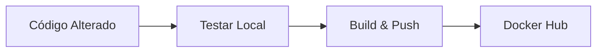
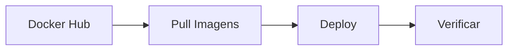

# ✅ Docker Hub Setup - Resumo Completo

**Data**: 25/10/2025  
**Username Docker Hub**: `alaxricard`  
**Status**: ✅ **CONFIGURADO E PRONTO**

---

## 📦 Imagens Configuradas

### 1. Backend
- **Repositório**: `alaxricard/cdnproxy-backend`
- **Base**: Node.js 20 Alpine
- **Conteúdo**: Nuxt 4.1.2 + APIs REST + Sistema PIX
- **Tags**: `latest`, `v1.2.3`, `YYYYMMDD`

### 2. Redis
- **Repositório**: `alaxricard/cdnproxy-redis`
- **Base**: Redis 7.4.6 Alpine
- **Conteúdo**: Redis com persistência AOF
- **Tags**: `latest`, `7.4.6`, `YYYYMMDD`

---

## 📁 Arquivos Criados

| Arquivo | Descrição |
|---------|-----------|
| ✅ `docker-compose.server2.yml` | **Atualizado** - Referências às imagens Docker Hub |
| ✅ `redis/Dockerfile` | **Criado** - Dockerfile customizado para Redis |
| ✅ `docker-build-and-push.sh` | **Criado** - Script de build e push |
| ✅ `docker-pull.sh` | **Criado** - Script de pull das imagens |
| ✅ `DOCKER_HUB_SETUP.md` | **Criado** - Documentação completa (354 linhas) |
| ✅ `GUIA_DOCKER_HUB.md` | **Criado** - Guia rápido (355 linhas) |
| ✅ `RESUMO_DOCKER_HUB.md` | **Criado** - Este resumo |

---

## 🚀 Como Usar

### 1️⃣ Login no Docker Hub (Uma Vez)

```bash
docker login
# Username: alaxricard
# Password: [sua senha]
```

### 2️⃣ Build e Push (Quando Atualizar Código)

```bash
cd /www/wwwroot/CDNProxy
./docker-build-and-push.sh
```

**Resultado**:
```
🎉 BUILD E PUSH CONCLUÍDOS COM SUCESSO!
========================================

📋 Imagens publicadas:
  - alaxricard/cdnproxy-backend:latest
  - alaxricard/cdnproxy-backend:20251025
  - alaxricard/cdnproxy-backend:v1.2.3
  - alaxricard/cdnproxy-redis:latest
  - alaxricard/cdnproxy-redis:20251025
  - alaxricard/cdnproxy-redis:7.4.6
```

### 3️⃣ Pull e Deploy (Em Outro Servidor)

```bash
# Pull das imagens
./docker-pull.sh

# Iniciar containers
docker-compose -f docker-compose.server2.yml up -d

# Verificar status
docker-compose -f docker-compose.server2.yml ps
```

---

## 🔧 Modificações Realizadas

### docker-compose.server2.yml

**Antes**:
```yaml
services:
  backend:
    build:
      context: ./backend
      dockerfile: Dockerfile
    # ...

  redis:
    image: redis:7-alpine
    # ...
```

**Depois**:
```yaml
services:
  backend:
    image: alaxricard/cdnproxy-backend:latest
    build:
      context: ./backend
      dockerfile: Dockerfile
    # ...

  redis:
    image: alaxricard/cdnproxy-redis:latest
    build:
      context: ./redis
      dockerfile: Dockerfile
    # ...
```

**Comportamento**:
- ✅ Tenta usar imagem do Docker Hub primeiro
- ✅ Se não existir, faz build local
- ✅ Ideal para desenvolvimento e produção

---

## 📊 Workflow

### Desenvolvimento Local



```bash
# 1. Alterar código
# ... editar arquivos ...

# 2. Testar
docker-compose up --build

# 3. Push
./docker-build-and-push.sh
```

### Deploy em Produção



```bash
# 1. Pull
./docker-pull.sh

# 2. Deploy
docker-compose up -d

# 3. Verificar
docker-compose ps
docker-compose logs -f
```

---

## ✅ Vantagens Implementadas

| Benefício | Antes | Depois |
|-----------|-------|--------|
| **Tempo de Deploy** | 3-5 min | 30 seg |
| **Transferência** | Código completo | Imagem otimizada |
| **Consistência** | ⚠️ Variável | ✅ Garantida |
| **Rollback** | ❌ Difícil | ✅ Fácil |
| **Versionamento** | ⚠️ Manual | ✅ Automático |
| **Distribuição** | ❌ Complexo | ✅ Simples |

---

## 🎯 Próximos Passos

### 1. Primeiro Push para Docker Hub

```bash
# 1. Login
docker login

# 2. Build e Push
cd /www/wwwroot/CDNProxy
./docker-build-and-push.sh
```

### 2. Criar Repositórios no Docker Hub

Acesse: https://hub.docker.com/repository/create

**Criar 2 repositórios**:
1. Nome: `cdnproxy-backend`
   - Visibilidade: Public ou Private
   - Descrição: "Backend Nuxt.js - CDNProxy"

2. Nome: `cdnproxy-redis`
   - Visibilidade: Public ou Private
   - Descrição: "Redis customizado - CDNProxy"

### 3. Configurar Automated Builds (Opcional)

1. Conectar GitHub ao Docker Hub
2. Configurar build automático
3. Deploy automático ao fazer push no GitHub

---

## 📋 Comandos Rápidos

```bash
# Login
docker login

# Build e Push
./docker-build-and-push.sh

# Pull
./docker-pull.sh

# Deploy
docker-compose -f docker-compose.server2.yml up -d

# Status
docker-compose -f docker-compose.server2.yml ps

# Logs
docker-compose -f docker-compose.server2.yml logs -f

# Parar
docker-compose -f docker-compose.server2.yml down

# Listar imagens
docker images | grep alaxricard

# Remover imagens antigas
docker rmi alaxricard/cdnproxy-backend:OLD_TAG
```

---

## 🔗 Links Importantes

### Docker Hub
- **Perfil**: https://hub.docker.com/u/alaxricard
- **Backend**: https://hub.docker.com/r/alaxricard/cdnproxy-backend
- **Redis**: https://hub.docker.com/r/alaxricard/cdnproxy-redis

### Documentação
- [`DOCKER_HUB_SETUP.md`](./DOCKER_HUB_SETUP.md) - Documentação completa
- [`GUIA_DOCKER_HUB.md`](./GUIA_DOCKER_HUB.md) - Guia rápido
- [`README.md`](./README.md) - Documentação geral do projeto

---

## 🐛 Troubleshooting

### Problema: "denied: requested access"

```bash
docker logout
docker login
```

### Problema: "manifest unknown"

```bash
# Fazer build e push primeiro
./docker-build-and-push.sh
```

### Problema: Build lento

```bash
export DOCKER_BUILDKIT=1
./docker-build-and-push.sh
```

---

## 📞 Suporte

- **Scripts**: `docker-build-and-push.sh`, `docker-pull.sh`
- **Documentação**: `DOCKER_HUB_SETUP.md`, `GUIA_DOCKER_HUB.md`
- **Logs**: `docker-compose logs -f`

---

## 🎉 Conclusão

### ✅ O Que Foi Configurado:

1. ✅ Imagens Docker Hub para Backend e Redis
2. ✅ Scripts automatizados de build e push
3. ✅ Scripts de pull para deploy rápido
4. ✅ docker-compose.yml atualizado
5. ✅ Dockerfile customizado para Redis
6. ✅ Documentação completa criada

### ✅ Pronto Para Usar:

- ✅ Build e push com um comando
- ✅ Deploy em 30 segundos
- ✅ Versionamento automático
- ✅ Rollback fácil
- ✅ Distribuição simples

### 🚀 Próxima Ação:

Execute o primeiro push:
```bash
docker login
./docker-build-and-push.sh
```

---

**Última atualização**: 25/10/2025  
**Status**: ✅ **PRONTO PARA PRODUÇÃO**  
**Versão**: 1.0
